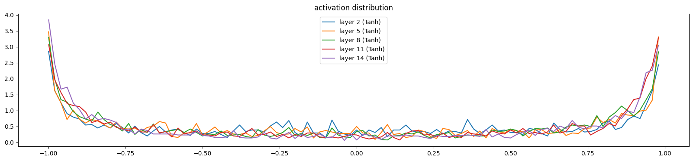
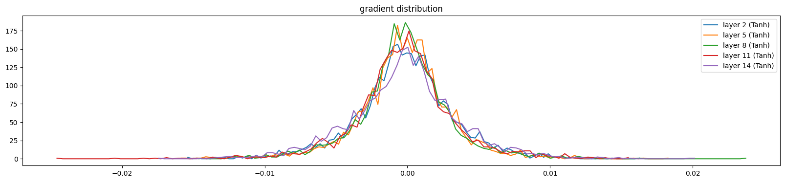
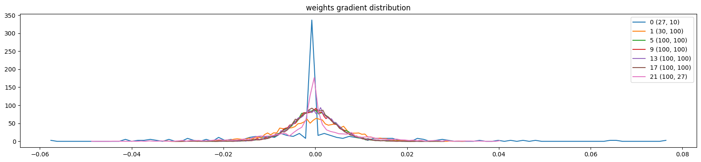
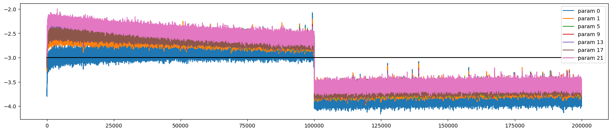

# makemore-from-scratch

Rebuilding Andrej Karpathy's [makemore](https://github.com/karpathy/makemore) series from scratch — every line typed by hand, no copy-pasting. Built to develop ground-up intuition for neural network training before moving into production AI security work.

> **Where this leads →** Currently building an [Adversarial RAG System](https://github.com/Shiva-Sai-Krishna-0408) — a document Q&A pipeline attacked with 7+ adversarial classes and hardened with defenses for each.

---

## Part 1 — Bigram Model

Character-level language model with no hidden layers. Built a full training loop from scratch: probability distributions over next characters, negative log-likelihood loss, and gradient descent weight updates in raw PyTorch.

## Part 2 — MLP

Scaled to a 3-character context window. Implemented embedding lookup → hidden layer → softmax → cross-entropy loss, with mini-batch gradient descent and train/dev/test splits.

**Dev loss: 2.1659** — beat Karpathy's benchmark of 2.1701.

## Part 3 — Training Diagnostics & Batch Normalization

Diagnosed broken training through activation distributions, gradient flow plots, and update-to-data ratios. Discovered and fixed tanh saturation caused by bad initialization.

Implemented from memory:
- Kaiming initialization
- Batch normalization with running mean/std buffers
- PyTorch-style `Linear`, `BatchNorm1d`, `Tanh` classes

**Dev loss: 2.08**

### Training Diagnostics (after Kaiming init + Batch Norm)

**Activation distribution** — healthy spread across tanh range, no saturation at ±1:



**Gradient distribution** — centered near zero, no vanishing or exploding:



**Weights gradient distribution** — consistent scale across layers:



**Update-to-data ratio** — stable learning rate across all parameters:



---

## Key takeaway

Broken training is invisible without visualization. A bad init wastes thousands of gradient steps before you ever see it in the loss curve. This project taught me to diagnose training, not just run it.

---

## Setup

```bash
git clone https://github.com/Shiva-Sai-Krishna-0408/makemore-from-scratch.git
cd makemore-from-scratch
pip install torch matplotlib
```

Built with Python, PyTorch, and matplotlib. No frameworks, no shortcuts.